# Correções, migração para Cloudflare e preparação para escala

**Produtos:** ORBI, TORVEN e RUSTEN.  
**Data:** 03/10/2026.
**Revisão:** 05/10/2026 — preparação para localizar, receber e integrar os arquivos do RUSTEN ao GitHub.  
**Uso:** especificação e prompt de implementação para VibeCode/Codex ou equipe de desenvolvimento.  
**Estado deste documento:** proposta de implementação; não comprova correções, migração ou publicação já realizadas.

## 1. Instrução ao agente de programação

Analise integralmente o repositório aberto antes de editar arquivos. Implemente as correções aplicáveis e prepare a migração dos três sistemas para a Cloudflare, preservando o Supabase como infraestrutura de dados e os backends Supabase que já estiverem funcionando. Ao concluir a migração, nenhuma função necessária à operação deve continuar dependendo de uma aplicação hospedada na Vercel.

Execute o trabalho por produto, com branch própria, migrações versionadas e homologação. Preserve usuários, empresas, identificadores, dados, layout, regras comerciais, permissões, planos, vigências, históricos, integrações e funcionalidades existentes. Não recrie os sistemas do zero.

Este documento pode ser aplicado separadamente em cada repositório. Resolva os contratos compartilhados da central Master antes de alterar seus consumidores. Se um repositório ou acesso estiver ausente, execute primeiro o fluxo de localização e recebimento da seção 2.1. Registre a pendência somente após verificar as fontes acessíveis; não invente arquivos, endpoints, recursos ou resultados de testes.

Regras obrigatórias:

- Não apagar bases, usuários, arquivos ou projetos como atalho de migração.
- Não incluir valores reais de senhas, chaves JWT, tokens administrativos ou credenciais de pagamento em código, documentação, exemplos ou logs.
- Não criar credenciais Master fixas. Preservar a identidade administrativa com recuperação segura, MFA e auditoria.
- Não enfraquecer criptografia, autorização ou verificação de pagamentos para caber no plano gratuito.
- Não executar teste de carga ou exploração de dados reais em produção. Usar homologação e contas fictícias.
- Não marcar segurança, cobrança, escala ou recuperação como aprovadas sem evidência.
- Não contratar serviços pagos nem registrar domínios automaticamente a partir deste prompt. Preparar os recursos e informar seus requisitos e custos.

## 2. Inventário e evidências anteriores

As referências abaixo vêm de revisão parcial e retestes realizados em 02/10/2026. Conferir a branch e o deployment atuais: o código examinado não foi comprovado como idêntico à publicação.

| Produto | Configuração ou condição examinada | Trabalho necessário |
|---|---|---|
| ORBI | `frontend/vercel.json` encaminha `/api/*` para `orbi-api.vercel.app`; backend Node/Express e central de assinaturas no código analisado | Migrar a API e a central, além da interface; identificar o destino efetivo em produção |
| TORVEN | Configuração encaminha `/api/*` para `torven-api` em Supabase Edge Functions; snapshot também contém backend Node/Express | Preservar o backend publicado correto e substituir o encaminhamento da Vercel |
| RUSTEN | Bundle publicado consulta `rusten-api` no Supabase; repositório completo não foi localizado anteriormente | Obter o código correto, validar contratos e introduzir acesso à API pela mesma origem da interface |
| RUSTEN — planos | API usa `monthly_price`/`annual_price` em reais; interface examinada esperava `monthly_cents`/`yearly_cents` | Normalizar o contrato sem multiplicar/dividir valores duas vezes |
| Sessões e segredos | Foram identificados defeitos de revogação e validação de configuração nos snapshots ORBI/TORVEN | Corrigir e retestar; não pressupor que todas as condições estejam presentes em produção |

Antes de implementar, entregar um inventário com: repositório, commit, framework, comando de build, diretório de saída, APIs, banco, funções, uploads, filas, cron, webhooks, central Master, domínios, variáveis necessárias e dependências externas. Listar nomes de segredos, nunca seus valores.

Pesquisar dependências de `.vercel.app`, `VERCEL`, rewrites, redirects, timers locais, disco local, contadores em memória, `localStorage`, URLs de API e URLs do gateway. Conferir também configurações persistidas no banco e no painel Master. Registros históricos podem guardar URLs antigas; eles não precisam ser apagados para eliminar uma dependência operacional.

### 2.1 Localizar ou receber os arquivos-fonte do RUSTEN

**Objetivo:** permitir que o agente encontre o projeto existente ou receba os arquivos posteriormente, compare seu conteúdo e integre as alterações ao GitHub sem recriar o sistema nem perder código atual. Esta seção é uma instrução para execução futura; não comprova arquivos encontrados, acesso concedido ou upload realizado.

**Destino informado na conversa:** `lealves05/RUSTEN`, com branch principal informada como `main`. Confirmar existência, proprietário, acesso, branch padrão e commit remoto no momento da execução. Não criar outro repositório nem alterar sua visibilidade como substituição automática.

#### A. Procurar antes de solicitar novo envio

1. Examinar anexos, pastas do projeto e checkouts disponíveis no ambiente autorizado. Usar buscas por nomes e arquivos como `package.json`, lockfiles, `src`, `frontend`, `backend`, `supabase`, migrações e configurações de build. Limitar a busca às áreas pertinentes ao projeto.
2. Consultar o repositório informado por integração GitHub ou Git autenticado disponível; inspecionar a árvore, branches e histórico relevante. Não concluir que o projeto está ausente apenas porque não está na branch padrão.
3. Quando disponíveis e pertinentes, procurar exportações anteriores do RUSTEN nos arquivos do usuário ou no ambiente de desenvolvimento acessível. Não pressupor acesso ao computador do usuário nem a serviços não conectados.
4. Confirmar a identidade pelo conjunto de evidências: nome do projeto, telas/rotas, configuração de build, contratos de API, histórico e módulos do RUSTEN. Nome de pasta isolado não comprova que é a versão correta.
5. Se houver várias versões, comparar origem, commit, conteúdo e completude. Não escolher somente pela data do arquivo; solicitar escolha apenas se a ambiguidade persistir após a comparação.
6. Se o repositório contiver o código completo e utilizável, seguir com ele sem exigir ZIP. Se não houver fonte suficiente, registrar o que foi consultado e solicitar apenas os arquivos ou o acesso faltantes.

#### B. Receber ZIP, pasta ou arquivos complementares

Aceitar ZIP exportado do projeto, pasta acessível no ambiente ou arquivos individuais para complementar a versão existente. Um link de repositório acessível também serve como origem. Ao receber novo material, retomar este fluxo sem reiniciar o trabalho já validado.

Solicitar, conforme a estrutura real:

- Código da interface, APIs, funções Supabase e componentes compartilhados usados pelo RUSTEN.
- Manifestos de dependências, lockfile, configurações de build e arquivos estáticos necessários.
- Migrações, políticas de acesso, testes e instruções existentes de execução.
- `.env.example` somente com nomes e placeholders; credenciais devem ser configuradas pelo mecanismo seguro do ambiente.

Não exigir que todos esses diretórios existam: classificar cada componente como encontrado, não aplicável ou pendente. Um Markdown de requisitos, link da aplicação publicada, captura de tela ou bundle compilado não equivale ao projeto-fonte completo. Não apresentar reconstrução de bundle como recuperação fiel do original.

Extrair arquivos em diretório temporário separado, sem sobrescrever o checkout. Validar caminhos para impedir saída do diretório de extração, links perigosos e expansão excessiva. Inspecionar scripts antes de executá-los e não carregar variáveis de produção automaticamente.

#### C. Comparar e preparar a integração

1. Registrar origem dos arquivos, branch e commit remoto de referência; registrar checksum do ZIP quando houver.
2. Verificar alterações locais e preservá-las antes de atualizar referências. Trabalhar em branch própria, por exemplo `chore/rusten-importacao-AAAAMMDD`, a partir da base remota confirmada.
3. Produzir comparação de arquivos novos, modificados, iguais, conflitantes e ausentes no pacote. Ausência no ZIP não autoriza excluir arquivo já existente no GitHub.
4. Integrar somente os arquivos pertinentes, preservando alterações remotas e locais. Resolver conflitos com base no funcionamento e no histórico; não usar sobrescrita integral, `reset --hard`, `push --force` ou exclusão como atalho.
5. Excluir do envio segredos, `.env` reais, certificados privados, dumps de clientes, backups de dados, logs sensíveis, dependências instaladas e artefatos descartáveis. Preservar exemplos sem valores reais e respeitar arquivos gerados que o projeto comprovadamente versione.
6. Revisar `.gitignore`, diff e arquivos preparados para commit. Se encontrar segredo no material recebido, impedir seu envio e registrar a necessidade de tratamento sem reproduzir o valor.
7. Executar instalação conforme o gerenciador/lockfile identificado, build e verificações existentes relevantes em ambiente isolado. Não aplicar migrações nem executar integrações financeiras contra produção para validar a importação.
8. Registrar falhas e dependências ausentes. Não declarar que o projeto foi validado se não foi possível executar as verificações.

#### D. Enviar ao GitHub e permitir retomada

Quando houver autorização de envio ao GitHub, criar commit identificável, enviar a branch de trabalho e abrir pull request quando o recurso estiver disponível. A solicitação anterior de adicionar os arquivos do RUSTEN autoriza esse envio quando os arquivos forem localizados ou recebidos; não pedir a mesma autorização novamente. Respeitar proteções de branch e permissões disponíveis.

Não fazer merge na branch principal nem disparar publicação em produção como consequência automática da importação. Conferir previamente os gatilhos de CI/deploy da branch de destino; se o envio implicar publicação fora do escopo autorizado, preparar o commit e informar o impedimento antes desse efeito.

Se faltar autenticação, solicitar a conexão pelo fluxo seguro disponível; nunca pedir token ou senha em texto no chat. Se faltar código, entregar a lista objetiva de componentes pendentes e manter a preparação pronta para retomada. Não simular um push bem-sucedido.

**Registro de acompanhamento a preencher na execução:**

| Campo | Valor inicial |
|---|---|
| Produto | RUSTEN |
| Repositório informado | `lealves05/RUSTEN` |
| Branch principal informada | `main` — confirmar no remoto |
| Origem efetivamente utilizada | A preencher após localização ou recebimento |
| Commit remoto de referência | A preencher após consulta |
| Branch de trabalho | A preencher na preparação |
| Componentes encontrados e pendentes | A preencher após inventário |
| Verificações e limitações | A preencher após execução |
| Commit enviado / pull request | A preencher somente após confirmação remota |
| Estado | Preparado para localizar ou receber arquivos; execução pendente |

**Critérios de aceite:** localizar fonte utilizável ou listar exatamente o que falta; preservar código existente; revisar segredos e conflitos; registrar build/verificações; confirmar o commit remoto após envio e fornecer branch/PR. Separar os estados “arquivos recebidos”, “comparação concluída”, “commit local”, “enviado ao GitHub” e “publicado em produção”. Um estado não comprova os seguintes.

## 3. Arquitetura de destino

### 3.1 Hospedagem e backend

| Camada | Destino e regra |
|---|---|
| Interfaces dos três produtos | Cloudflare Workers com Static Assets, um projeto por produto |
| Endpoints públicos do sistema | Mesma origem da interface, sob `/api`, encaminhados por Worker/BFF quando necessário |
| ORBI API e central Master/Hub | Worker de backend na Cloudflare, preservando regras e contratos existentes; vinculação interna ao Worker web quando viável |
| TORVEN e RUSTEN API | Manter as Edge Functions Supabase publicadas, após correções, atrás do BFF da Cloudflare |
| PostgreSQL, autenticação existente e arquivos | Preservar Supabase e o modelo de identidade atual durante a migração de hospedagem |
| Backups independentes | Cópia criptografada em bucket privado R2 ou armazenamento externo equivalente |
| Processamento assíncrono | Filas duráveis e consumidores compatíveis com os limites reais do runtime |
| Publicação | GitHub integrado à Cloudflare, com homologação e produção separadas |

**Todos os acessos web passam a ser publicados pela Cloudflare.** Supabase permanece como backend de dados e, onde já existir, de funções. Migrar essas funções para Workers também só se houver benefício comprovado e testes de equivalência; não é necessário para retirar a dependência da Vercel.

O BFF é a camada de servidor que recebe as chamadas do navegador no domínio do sistema, gerencia a sessão e chama o backend. Não pode funcionar como proxy aberto para qualquer URL informada pelo cliente.

```mermaid
flowchart TD
  subgraph C["Cloudflare"]
    O["ORBI web e BFF"]
    T["TORVEN web e BFF"]
    R["RUSTEN web e BFF"]
    H["ORBI API e Master/Hub"]
  end
  subgraph S["Supabase"]
    TE["TORVEN Edge API"]
    RE["RUSTEN Edge API"]
    D["Dados e arquivos por produto"]
  end
  O --> H
  T --> TE
  R --> RE
  H --> D
  TE --> D
  RE --> D
  TE <--> H
  RE <--> H
  D --> B["Backup independente"]
  H --> P["Gateway de assinaturas"]
```



Confirmar as ligações Hub/produto no inventário. O diagrama representa o destino pretendido; não comprova quais integrações já estão instaladas.

### 3.2 Bancos e empresas

Primeiro migrar hospedagem mantendo os bancos atuais. Não combinar troca de hospedagem, troca de autenticação, troca de gateway e divisão de banco em uma única publicação.

O destino recomendado para reduzir impacto entre produtos é um projeto Supabase por produto. Se hoje compartilham um projeto, preparar a divisão como etapa própria, com cópia validada, controle de gravações no corte e reconciliação. Até essa etapa, registrar o risco de compartilhamento e aplicar isolamento por produto e empresa.

Dentro de cada produto, atender várias empresas com isolamento rígido. Se o código atual utiliza `company_id`, manter esse identificador e mapear o conceito de tenant; não renomear todas as tabelas para `tenant_id` sem necessidade.

Homologação usa dados fictícios e credenciais próprias. Uma homologação compartilhada entre produtos é possível inicialmente, desde que mudanças sejam coordenadas; não conectar previews à produção por padrão.

### 3.3 Domínios econômicos

Suportar as duas configurações abaixo, com nomes sujeitos a registro/disponibilidade:

| Modelo | ORBI | TORVEN | RUSTEN |
|---|---|---|---|
| Um domínio comercial | `orbi.sua-marca.com.br/entrar` | `torven.sua-marca.com.br/entrar` | `rusten.sua-marca.com.br/entrar` |
| Domínios próprios | `orbi.com.br/entrar` | `torven.com.br/entrar` | `rusten.com.br/entrar` |

São exemplos, não domínios comprovadamente disponíveis ou pertencentes ao titular. A opção de um domínio com subdomínios reduz os registros necessários.

Adicionar a zona DNS à Cloudflare, preservar registros de e-mail e verificações existentes, vincular os hostnames aos Workers e aguardar certificado HTTPS válido antes do corte. Atualizar origens permitidas, links de convite/reset, OAuth, retorno do gateway e webhooks. Usar origens configuradas; não construir links sensíveis a partir de um `Host` recebido sem validação.

## 4. Configuração Cloudflare e contrato de rotas

### 4.1 Configuração de referência

Gerar um `wrangler.jsonc` por produto e ambiente. Exemplo ilustrativo para RUSTEN com frontend estático e BFF; adaptar caminhos e variáveis ao repositório real:

```json
{
  "$schema": "node_modules/wrangler/config-schema.json",
  "name": "rusten-web",
  "main": "src/cloudflare/worker.ts",
  "compatibility_date": "2026-10-03",
  "assets": {
    "directory": "./dist",
    "binding": "ASSETS",
    "not_found_handling": "single-page-application",
    "run_worker_first": ["/api", "/api/*", "/webhooks", "/webhooks/*"]
  },
  "vars": {
    "APP_ENV": "production",
    "PRODUCT_ID": "rusten",
    "APP_ORIGIN": "https://rusten.sua-marca.com.br"
  },
  "observability": {
    "enabled": true
  }
}
```

O arquivo de entrada deve ser implementado e testado. Não publicar o exemplo com domínio fictício. `dist` precisa corresponder ao build real. As rotas `/webhooks` só serão utilizadas se compatíveis com a integração existente; inventariar as rotas atuais e encaminhá-las explicitamente, inclusive as localizadas sob `/api`.

Criar configurações ou Workers separados para homologação. Não assumir herança automática de bindings, segredos e variáveis entre ambientes. Consultar a documentação atual do runtime e fixar a versão validada do Wrangler no lockfile.

### 4.2 Comportamento obrigatório

- `/entrar`, `/cadastro` e rotas internas devem funcionar em navegação direta e após atualizar a página.
- `/api` e seus descendentes entram no handler do backend/BFF antes do fallback da SPA.
- API desconhecida responde JSON com `404`; método não permitido responde `405`. Não retornar `index.html` como sucesso de API.
- `/api/auth/me` sem sessão deve responder o estado de autenticação previsto, normalmente `401`, nunca HTML com `200`.
- Preservar método, query, status, corpo e tipo de conteúdo quando houver encaminhamento. Definir limites e prazos por tipo de operação.
- Mapear os prefixos exatamente uma vez. Para a função `rusten-api`/`torven-api`, conferir se a base termina no nome da função e se o caminho inclui `/api`; impedir `/api/api` e caminhos perdidos.
- Frontend passa a usar base relativa `/api` para as APIs de negócio. Chamadas diretas ao Storage/Realtime, se necessárias, continuam com autorização própria e origens exatas na CSP.
- Evitar dependência de URL fixa da Vercel em qualquer recurso necessário ao funcionamento.
- Resolver downloads, uploads e respostas por streaming sem carregar arquivos grandes inteiros na memória do Worker.
- Assets com hash podem usar cache longo; HTML deve permitir obtenção da versão atual. Limpar/adaptar Service Worker e caches de versões antigas, se existirem.

### 4.3 BFF e comunicação com Supabase

Implementar destinos fixos por produto e ambiente. Bloquear uso de parâmetros do navegador como host de upstream, URL de callback interna ou destino de proxy. Tratar redirects do upstream com allowlist para impedir envio de credenciais a outro host.

Remover cabeçalhos de identidade e encaminhamento enviados pelo cliente antes de construir os cabeçalhos confiáveis. Não aceitar `X-Tenant-ID`, `X-User-ID`, `X-Forwarded-For` ou equivalentes como prova de identidade.

O backend deve validar sessão, empresa e permissões de forma independente. Se uma Edge Function for exclusiva do BFF, proteger também a chamada entre serviços, com credencial específica ou assinatura com prazo e proteção contra replay. CORS não impede acesso direto por ferramentas externas.

Configurar explicitamente a verificação de JWT da Edge Function conforme o modelo real de autenticação. Não desabilitar verificação sem substituí-la por validação comprovada no handler. JWT próprio da aplicação não deve ser confundido com JWT do Supabase Auth.

Cookies de sessão precisam ser emitidos para a origem pública do sistema. Não encaminhar cegamente `Set-Cookie` com domínio Supabase nem repassar cookies de outros serviços. Adaptar somente cookies conhecidos e testados, mantendo `HttpOnly`, `Secure` e escopo adequado.

### 4.4 Migração da API ORBI e da central

Separar construção da aplicação, configuração, acesso a dados e entrada do runtime. Conferir os módulos Node/Express e executar testes reais em Workers; um build bem-sucedido não comprova compatibilidade de execução.

Workers tem suporte a Express por meio do adaptador documentado. Adaptar a entrada e validar `pg`, JWT, bcrypt, criptografia, headers, compressão, uploads e integrações. Não copiar o exemplo de banco D1 do tutorial: este projeto mantém PostgreSQL/Supabase. Verificar compatibilidade pela data e pelas APIs utilizadas, sem assumir que Node completo está disponível.

Preferir Service Binding entre ORBI web/BFF e ORBI API quando a arquitetura permitir. Endpoints usados por TORVEN/RUSTEN continuam acessíveis por uma rota externa controlada e autenticada, enquanto seus backends estiverem no Supabase.

Substituir a descoberta de produção baseada em `VERCEL` por configuração explícita, como `APP_ENV`. Em produção, configuração ausente ou inválida deve falhar de modo seguro. Nunca ativar valores de desenvolvimento porque a variável `VERCEL` deixou de existir.

Preservar o contrato `/api/hub/v1` e as rotas de plataforma existentes. Atualizar `PLATFORM_HUB_URL`, URLs dos produtos cadastradas no Master, destinos de webhook e serviços consumidores. Manter os IDs de empresas, produtos, planos, assinaturas e permissões; migrar a central sem criar cobranças novas.

Não executar cron ou timers antigos em paralelo com os novos consumidores. Confirmar que há somente um responsável ativo por cada rotina de renovação, aviso e bloqueio.

## 5. Variáveis, credenciais e rotação

Gerar exemplos por ambiente com valores vazios/placeholders. Documentar quais nomes são novos e como se relacionam com os nomes atuais. Não renomear variável sem atualizar todos os consumidores.

| Categoria | Exemplos de nomes | Local e regra |
|---|---|---|
| Configuração pública | `APP_ORIGIN`, `PRODUCT_ID`, caminho `/api` | Sem credenciais; validar origem e produto |
| Frontend que usa APIs Supabase diretamente | URL do projeto e chave publishable/anon aplicável | Somente com RLS/políticas testadas; essas chaves não concedem acesso administrativo |
| Backend | `DATABASE_URL`, chave privilegiada Supabase quando estritamente necessária | Secret/binding do ambiente correspondente; nunca variável pública do frontend |
| Autenticação | `JWT_SECRET` ou conjunto de chaves de assinatura versionadas | Chave forte e separada por finalidade/produto conforme a arquitetura |
| Criptografia persistida | `DATA_ENCRYPTION_KEY`, versões anteriores durante transição | Separada de assinatura JWT; preservar decifragem dos dados existentes |
| Hub/produtos | `PLATFORM_HUB_URL`, segredo específico de integração | Credenciais por produto; limitar ações e auditar |
| Gateway | Access token, segredo de webhook e configuração do provedor | Somente no backend responsável; sandbox separado |
| Implantação | Token Cloudflare e acesso CI/Supabase | Permissões e escopo mínimos; não copiar token da conta principal para todos os jobs |

**Particularidade ORBI:** o código examinado usa a chave JWT para derivar chaves que decifram configurações persistidas (`derivedKey`, `seal`, `unseal`). Rotação direta pode tornar credenciais do Hub ilegíveis. Inventariar esses usos, fazer backup e implementar leitura das versões antigas seguida de recriptografia validada antes de retirar a chave anterior.

Criar uma chave aleatória adequada à finalidade, com no mínimo 32 bytes aleatórios quando houver segredo simétrico. Configuração publicada com chave ausente, literal de exemplo, curta ou conhecida deve ser recusada, após carregar toda a configuração efetiva. Não logar o valor nem usar padrão de desenvolvimento.

Preservar temporariamente as chaves de dados necessárias para ler informações antigas. A janela de aceitação de tokens antigos deve ser explícita, limitada e independente da conservação de uma chave para decifragem. Se houve uso de segredo fraco, tratar a substituição e a revogação como correção de credencial.

## 6. Correções de segurança obrigatórias

### 6.1 Sessão, login e Master

1. Validar assinatura, algoritmo permitido, emissor, audiência/finalidade, expiração, usuário, produto, empresa e estado da sessão.
2. Vincular acesso a uma sessão revogável no servidor. Logout revoga sessão e refresh da família correspondente; token antigo não continua autorizado até sua expiração longa.
3. Implementar versão de autenticação quando compatível com o modelo atual. Todas as alterações de senha incrementam a versão na mesma transação do hash: mudança própria, administrativa, recuperação e ativação.
4. Preservar hashes legados durante a transição. Aplicar política central de senha em todos os fluxos; nunca truncar silenciosamente entradas acima do limite em bytes do algoritmo utilizado.
5. Preferir access token curto, com referência inicial de 15 minutos, e refresh rotativo protegido. Armazenar hash de refresh no banco e tratar reutilização com revogação coerente.
6. Retirar refresh e tokens administrativos de `localStorage`/`sessionStorage`. Usar cookies `HttpOnly; Secure`, com `SameSite` compatível, e access em memória quando necessário.
7. Preferir cookies com prefixo `__Host-`, `Path=/` e sem atributo `Domain`; usar nomes separados por produto e finalidade. Não compartilhar uma sessão comum entre todos os subdomínios.
8. Aplicar proteção CSRF nas operações com autenticação por cookie: origem exata e token CSRF quando aplicável. Incluir login/refresh na análise de CSRF. Webhooks e integrações servidor-servidor têm validação própria e não dependem de uma sessão do navegador.
9. Não encaminhar refresh em JSON ao navegador quando o fluxo depende de cookie HttpOnly. Limpar armazenamento legado sem apagar dados de negócio.
10. Separar sessão Master da sessão comum. Token de empresa não acessa Master, e token Master não se transforma automaticamente em sessão comum.
11. Manter a área Master e suas funções atuais, incluindo visão dos sistemas, prazos, liberação/bloqueio e configuração de testes. Exigir MFA para acesso administrativo conforme a implementação compatível; auditar concessões e acessos a empresas.

**Aceite:** sessões A/B; logout somente de A; troca de senha no mesmo segundo; reset administrativo; refresh simultâneo; reuso de refresh; duas abas; retorno de pagamento; cookies bloqueados entre sites; token de outro produto; token comum na área Master. Registrar o resultado de cada caso.

### 6.2 Isolamento entre empresas

Determinar a empresa pela identidade validada e pelo vínculo autorizado. Toda leitura, escrita, busca, relatório, exportação e acesso a arquivo deve respeitar esse contexto.

- Validar posse de todas as referências, inclusive `technician_id`, `unit_id`, clientes, profissionais, equipamentos, comandas, produtos, fornecedores, OS e contas financeiras.
- Verificar as referências na mesma transação da alteração. UUID válido não comprova pertencimento.
- Usar consultas parametrizadas e allowlist para campos de ordenação/filtro dinâmicos.
- Avaliar constraints compostas e políticas RLS como defesa adicional, preservando dados existentes e corrigindo inconsistências antes de exigir novas constraints.
- Não assumir que `service_role`, proprietário da tabela ou outro papel privilegiado respeita RLS. Proteger também as consultas do backend.
- Se utilizar Supabase Auth, derivar o vínculo autorizado da identidade correspondente. Se utilizar JWT próprio, não pressupor que `auth.uid()` reconheça essa sessão.
- Em acesso PostgreSQL com contexto por requisição, utilizar papel restrito e contexto definido pelo servidor, local à transação. Impedir vazamento de contexto entre conexões reutilizadas pelo pool.
- Arquivos privados exigem autorização antes de gerar URL temporária. Cópias, miniaturas e exportações mantêm a mesma regra de isolamento.

**Aceite:** empresas A/B com dados fictícios; tentar IDs de B como A em URL, query, JSON, campos aninhados, relacionamento, arquivo e exportação. Nenhuma leitura ou alteração indevida, inclusive parcial, é permitida.

### 6.3 Limites compartilhados e defesa contra abuso

Substituir contadores de login/recuperação/cadastro em memória por contagem compartilhada e atômica, com expiração e resposta `429`/`Retry-After`. Usar combinação de identificador normalizado, contexto e sinal de origem confiável; evitar bloqueio permanente de contas provocado por terceiros.

O limite de borda ajuda a reduzir tráfego, mas o Rate Limiting binding da Cloudflare é local à localização e possui consistência eventual. Não usá-lo como contador global exato, cota contratual ou contabilidade. Para limites globais críticos, usar operação atômica no PostgreSQL ou mecanismo equivalente validado.

No backend Supabase, garantir que chamadas diretas também respeitem limites/autorização. Identificadores e IPs propagados pelo BFF só são confiáveis quando a origem da propagação está autenticada; não confiar em header arbitrário do cliente.

Não aplicar desafios interativos a cada venda do PDV. Usar proteção compatível com clientes autenticados, integrações, webhooks e conexões compartilhadas por um estabelecimento.

**Aceite:** tentativas distribuídas entre duas instâncias somam corretamente onde o limite é global; reinício não apaga o contador; header falso não altera a identidade confiável; indisponibilidade do contador tem comportamento explícito e alertado.

### 6.4 CORS, CSP, headers e cache

Configurar origens exatas por ambiente. Em produção, configuração ausente não libera todas as origens das rotas privadas. Verificar a política no Worker, na Edge Function e na resposta final; uma camada externa pode acrescentar headers.

Gerar CSP a partir dos recursos efetivamente utilizados. Começar em modo Report-Only na homologação, corrigir violações e ativar a política obrigatória após validar login, tema, impressão, PDF, anexos, Storage, Realtime e checkout.

Diretrizes de proteção:

- Scripts inline devem ser externalizados ou autorizados por hash/nonce compatível; evitar `unsafe-eval` e liberação genérica de scripts.
- `frame-ancestors` no header HTTP; `object-src 'none'`; `base-uri` e `form-action` restritos conforme o fluxo aprovado.
- Permitir somente origens necessárias em `connect-src`, inclusive WebSocket Supabase quando usado.
- Aplicar `X-Content-Type-Options: nosniff`, política de referência e permissões compatíveis com os módulos. Leitor de código de barras físico não exige liberação de câmera; leitura por câmera pode exigir.
- HSTS somente com HTTPS validado; não aplicar `includeSubDomains` sem confirmar todos os subdomínios envolvidos.
- Respostas de autenticação, sessão, Master, dados pessoais/financeiros, exportações e erros de API usam `Cache-Control: no-store`.
- Não utilizar cache público de dados privados. Catálogo público, se cacheado, deve ter invalidação e nunca definir o preço final da contratação no navegador.
- Não cachear `Set-Cookie`. Não reutilizar resposta personalizada entre tenants ou usuários.
- Configurar headers tanto nos assets quanto nas respostas do Worker/API. O arquivo `_headers` de assets não substitui headers construídos pelo handler dinâmico.

Validar limite/tipo de upload, conteúdo real, nomes, acesso e distribuição. Não servir upload ativo como HTML executável no domínio principal. Arquivos grandes devem usar fluxo de Storage com autorização e validação adequadas, respeitando limites de todos os serviços envolvidos.

### 6.5 Correspondência com os achados anteriores

| IDs anteriores | Correção nesta especificação |
|---|---|
| F01/F03 | Segredos válidos, configuração explícita de produção e rotação sem perda de decifragem |
| F02 | Invalidação em todos os fluxos de alteração de senha |
| F04/F05 | Revogação de sessão, refresh protegido e transição de armazenamento no navegador |
| F06 | CORS por ambiente e conferência da resposta efetiva |
| F07 | Contadores compartilhados/atômicos, sem confundir limite regional com global |
| F08 | Política de senha uniforme e compatibilidade dos hashes |
| F09 | Posse de referências e isolamento A/B |
| F10/F11/F12 | CSP, headers e cache seguro no novo host |
| F13 | Regra explícita de assinatura quando a central estiver indisponível |
| R01/R02 | Contrato monetário e consistência das mensagens de desconto do RUSTEN |

## 7. Planos, gateway e disponibilidade da central

### 7.1 Contrato de preços e período de teste

Definir um modelo canônico de valores monetários, preferencialmente inteiros em centavos na fronteira de contratação. Preservar campos antigos enquanto houver consumidores ativos; converter somente no adaptador necessário e versionar o contrato.

Para o RUSTEN, corrigir especificamente a diferença entre campos em reais e campos em centavos. Tratar `null`, vazio, valor inválido e ciclo sem preço como indisponíveis para contratação, sem transformá-los em plano gratuito. Buscar o valor vigente no backend, sem confiar no valor enviado pelo cliente.

Definir o contrato de teste: 15 dias, 30 dias, prazo configurado pelo Master ou sem prazo, conforme as opções existentes. Não usar uma ausência de prazo como autorização ilimitada acidental. Preservar as vigências já concedidas.

Valores observados no reteste anterior, a reconferir no catálogo atual:

| RUSTEN | Mensal | Anual |
|---|---:|---:|
| Básico | R$ 79,90 | R$ 768,00 |
| Profissional | R$ 119,90 | R$ 1.295,00 |

Confirmar se o desconto anual do Profissional é intencional antes de alterar o catálogo. Não modificar preços por iniciativa do agente.

### 7.2 Cobrança e gateway independente

Preservar a camada independente de gateway, a conta Mercado Pago e as demais integrações efetivamente utilizadas. Implementar adaptadores com contrato documentado, sem mudar o provedor durante a migração de hospedagem.

No cenário gratuito Cloudflare, usar checkout hospedado no provedor com redirecionamento. Não coletar/processar dados de cartão na propriedade gratuita: os termos vigentes da Cloudflare restringem essa utilização. Assinatura recorrente pode continuar sendo gerida pelo gateway, desde que a modalidade escolhida ofereça a recorrência necessária; validar o fluxo real de adesão, autorização e renovação.

Requisitos:

1. Criar tentativa de contratação com produto, empresa, plano, ciclo, moeda, valor e identificador de idempotência determinados no servidor.
2. Validar o endereço HTTPS retornado pelo gateway antes de redirecionar o navegador. Não gerar redirect para URL arbitrária recebida do usuário.
3. Página de sucesso apenas informa o estado; não libera assinatura com base em query string ou retorno do navegador.
4. Webhook deve validar a assinatura segundo a documentação do provedor, preservar o conteúdo necessário à verificação e confirmar o estado autoritativo do pagamento.
5. Deduplicar eventos/transações no banco com unicidade durável. Guardar a recepção antes de responder sucesso e processar com repetição segura.
6. Atualizar pagamento, vigência e direitos de acesso de forma consistente. Usar outbox/inbox quando houver atualização entre serviços/produtos, com reconciliação.
7. Distinguir cobrança pendente, recusada, cancelada, estornada e aprovada. Evitar que um evento antigo reverta um estado mais recente; buscar o estado atual quando necessário.
8. Reconciliar eventos pendentes com intervalo configurável e respeito aos limites do gateway; proposta inicial de 15 minutos, a validar.
9. Migrar URLs de webhook e callbacks sem deixar dois processadores independentes produzindo cobranças. Reenvios durante a troca permanecem idempotentes.
10. Registrar trilha de plano, vigência e intervenção Master sem guardar dados de cartão, tokens ou credenciais nos logs.

### 7.3 Bloqueios e falha do Hub

Preservar prazo de carência configurável pelo Master, incluindo a regra de 15 dias quando vigente. Bloquear conforme a regra comercial sem apagar dados; manter regularização e acesso mínimo previsto pelo produto.

Introduzir modo inequívoco `saas_required` ou modo independente explicitamente autorizado. Em SaaS, central sem configuração não pode conceder acesso silencioso ilimitado.

Se o Hub cair, usar somente último estado validado, com prazo máximo e regras documentadas. Não liberar automaticamente uma empresa já bloqueada nem transformar uma falha transitória em bloqueio imediato de todos os clientes ativos. Definir comportamento para empresa sem estado anterior e para cache vencido.

O Hub deve poder recuperar o histórico a partir do banco e do gateway. Não armazenar a única cópia da vigência em memória de um Worker.

## 8. Funcionalidades comerciais que devem ser preservadas

| Produto | Fluxos de regressão mínimos |
|---|---|
| ORBI | Agenda, profissionais, clientes, caixa, permissões, unidades e notificações/integradores existentes |
| TORVEN | Entrada/saída de OS, técnicos, unidades, materiais, estoque, orçamento, caixa, anexos e integração fiscal existente |
| RUSTEN | Comandas, mesas, vendas, pagamentos, caixa, estoque, cancelamento/estorno e leitura de código de barras |
| Master | Empresas dos três sistemas, planos, vigência, teste, bloqueio/liberação, perfis e trilha de alterações |

No RUSTEN, preservar a dupla leitura de comanda/produto, a opção de desabilitá-la e o lançamento manual. Evitar que uma repetição de leitura/requisição grave a mesma venda duas vezes; distinguir isso de duas unidades realmente solicitadas pelo operador.

Venda, movimento de caixa e estoque devem manter consistência transacional. Calcular preços e totais no servidor. Usar identificação de operação e unicidade para repetição segura, com concorrência e rollback transacional quando uma etapa falhar.

Preservar a preparação/integradores InfinitePay já existentes, se presentes no código. Não anunciar captura automática de todas as vendas da maquininha sem API/integração efetivamente implementada e validada. Vendas externas e assinaturas SaaS precisam manter identificadores e conciliação próprios.

Definir contingência de internet do PDV. Se não existir modo offline validado, documentar registro controlado e reconciliação posterior. Um Service Worker que abre as telas não comprova capacidade de vender offline com segurança.

## 9. Escala e uso eficiente do Supabase

### 9.1 Banco e conexões

- Medir consultas lentas, conexões, CPU/memória, tráfego e crescimento antes de aumentar o plano.
- Paginar listas e relatórios; limitar filtros e intervalos; evitar consultas repetidas por item e carregamento de tabelas inteiras na interface.
- Criar índices a partir dos padrões reais, normalmente incluindo empresa nas consultas de negócio. Conferir planos e custo de escrita antes de acrescentar índices indiscriminadamente.
- Evitar polling excessivo; usar atualização por evento/Realtime quando necessário e autorizado, sem expor dados entre empresas.
- Limitar conexões por runtime e usar pool apropriado. Para funções serverless, avaliar pool em modo transação e compatibilidade de driver/prepared statements.
- Para ORBI Worker com PostgreSQL, avaliar Hyperdrive ou conexão compatível com o Supabase. A configuração deve ser ensaiada com TLS, transações, reconexão e concorrência.
- Se adotar Hyperdrive, começar com cache de consultas desabilitado nas operações privadas e de autorização. Só habilitar após demonstrar que parâmetros, identidade e contexto de tenant não podem produzir resposta cruzada ou desatualizada.
- Não depender de estado de sessão PostgreSQL persistente entre requisições em pool de transação. Contexto de tenant deve estar restrito à transação e não contaminar outra solicitação.
- Não executar migrations automaticamente a cada início de Worker ou réplica. Aplicar uma vez pelo fluxo controlado de entrega.

### 9.2 Processamento assíncrono

Tirar relatórios pesados, avisos, conciliação e integrações demoradas do caminho de venda/login. Utilizar filas duráveis com ID de tarefa, produto, empresa, tentativas, prazo, agendamento, trava/lease e estado de erro definitivo.

Consumidores são idempotentes e limitam concorrência. Uma tarefa só é reconhecida depois de seu resultado persistido. Quando a operação envolver provedor externo, usar idempotência do provedor e reconciliação; transação do banco não torna a chamada externa exatamente única por si só.

Pode-se utilizar a fila PostgreSQL/Supabase já existente ou um serviço Cloudflare apropriado. Escolher uma implementação principal e documentar sua cobrança. Não criar filas, Redis e workers adicionais apenas por antecipação de escala.

`waitUntil`, timer em memória ou processo local não substitui fila durável para cobrança, estoque e outras tarefas que precisam sobreviver a reinício/falha. Tarefas devem caber nos limites medidos de CPU, memória e duração do consumidor; fracionar ou mudar o consumidor quando necessário.

### 9.3 Critérios para ampliar recursos

| Evidência | Ação inicial |
|---|---|
| Consulta lenta, excesso de consultas ou conexões | Corrigir consultas, índices, paginação e pool |
| CPU/memória do banco insuficiente após otimização | Aumentar somente o projeto/produto afetado |
| CPU do Worker excedida em operação legítima | Rever o runtime/implementação e dimensionar o plano; preservar a segurança |
| Fila atrasada, sem saturação do banco | Ajustar consumidor e concorrência de forma gradual |
| Uploads/arquivos elevando custos | Otimizar tamanho, retenção e fluxo de envio; medir alternativa |
| Um cliente concentra grande volume | Aplicar cota do plano e avaliar isolamento dedicado com orçamento próprio |
| Homologações interferem entre si | Separar projetos e pipelines |

Não converter franquia de usuários em promessa de quantidade de clientes. Ensaiar concorrência, perfil de uso e pico representativos, principalmente caixa/comandas do RUSTEN.

## 10. Custos e limites do plano gratuito

Referência consultada em 03/10/2026: arquivos estáticos servidos pelo mecanismo Static Assets têm requisições gratuitas e ilimitadas; execução de código Worker é contabilizada separadamente. O Free informa 100 mil requisições por dia e limite de 10 ms de CPU por invocação. Workers Paid começa em US$ 5/mês por conta, com franquias e excedentes. Conferir as regras de contagem, inclusive chamadas entre serviços, no plano efetivamente utilizado.

Esses limites não equivalem a usuários nem a vendas por dia. Login, hashing e criptografia podem exigir plano pago mesmo com poucos usuários se ultrapassarem o limite por chamada. Medir essas operações em homologação. Não diminuir a dificuldade de hash, omitir validação ou introduzir liberação silenciosa para obter gratuidade.

O custo final inclui Supabase conforme configuração atual, domínio, backup, comunicação, gateway e recursos opcionais. Não declarar a operação dos três sistemas totalmente gratuita a partir da gratuidade das telas. Gerar a estimativa a partir do inventário efetivo, sem presumir três bancos novos já contratados.

Registrar alertas de consumo, CPU, erros por limite e orçamento. Limites de gasto podem restringir serviço e não abrangem todos os componentes; conferir cada produto antes de ativar bloqueio automático de consumo. Não abrir múltiplas contas para contornar franquias.

## 11. Backup, recuperação e migração de dados

### 11.1 Proteção antes de qualquer corte

Fazer backup dos dados, estrutura, migrações, arquivos privados e configurações necessárias à recuperação. Manter credenciais/chaves de recuperação em local protegido e separado das cópias criptografadas. GitHub guarda código, não substitui backup de dados.

Backups nativos do banco Supabase não incluem o conteúdo dos arquivos do Storage. Copiar os objetos separadamente, com manifesto de nomes, tamanhos e checksums. Automatizar exportação e verificar que cópias não estão vazias ou incompletas.

Usar credenciais específicas para backup e bucket privado. A aplicação não deve poder apagar as cópias antigas. Retenção inicial proposta: 30 cópias diárias e seis mensais, após calcular volume, tráfego e custo. Não depender do computador pessoal ou do `.bat` para a rotina de backup.

### 11.2 Recuperação adequada ao negócio

Definir, por produto, perda máxima tolerável e tempo de retorno antes de assumir metas comerciais. Cópia diária saudável pode deixar aproximadamente um dia de movimentações sem recuperação. Para RUSTEN operando caixa, avaliar proteção mais frequente, incluindo PITR quando o orçamento permitir.

PITR é adicional pago e exige compute Small ou superior no Supabase; não ativar como se fosse recurso gratuito. O ponto de restauração disponível, os arquivos e o tempo de indisponibilidade precisam ser testados. Como referência de engenharia, validar meta de perda de até cinco minutos para o caixa e retorno em até quatro horas; são metas propostas, não resultados já alcançados nem garantias do provedor.

Se essa proteção não puder ser contratada, documentar a alternativa, sua perda demonstrada e a contingência antes de operar. Fazer exportações mais frequentes somente após medir seu impacto e demonstrar recuperação; não equiparar exportação periódica a PITR.

Restaurar em ambiente isolado antes do lançamento e repetir mensalmente no início. Confirmar login, registros, vínculos, anexos, planos, vigências e totais financeiros. Verificar também a leitura das configurações criptografadas do Master.

### 11.3 Separação de projetos Supabase, quando necessária

Tratar como migração própria, após a hospedagem estabilizar:

1. Inventariar tabelas, funções, papéis, políticas, extensões, usuários, IDs, arquivos e vínculos compartilhados.
2. Preparar destino e executar cópia de homologação sem alterar produção.
3. Comparar contagens, checksums aplicáveis, relacionamentos, permissões e totais financeiros por empresa.
4. Definir estratégia de delta e pausa curta de escrita no corte, ou mecanismo de replicação/reconciliação demonstrado.
5. Não deixar duas bases aceitando gravações independentes sem reconciliar.
6. Configurar consumidores, Storage, Auth e URLs no destino com IDs preservados ou mapa explícito validado.
7. Manter a origem protegida durante a janela de recuperação. Desativar somente após aceite e retenção planejada.

## 12. Entrega contínua e arquivo de atualização

Preservar os repositórios e oferecer fluxo claro para o responsável:

1. O `.bat` continua enviando código ao GitHub, sem carregar credenciais Cloudflare/Supabase no arquivo.
2. Uma branch de homologação recebe alterações; produção utiliza somente versão validada e identificada.
3. CI instala dependências conforme o lockfile e executa build, lint/typecheck quando existentes e testes relevantes.
4. Publicação Cloudflare utiliza configuração e segredos exclusivos do ambiente.
5. Migrations são aplicadas de forma controlada antes/depois do deploy conforme compatibilidade; não introduzir remoção de campo usado por uma versão ainda ativa.
6. Verificação pós-publicação registra versão, rotas principais, login, dados e erros.

Entregar scripts com nomes adaptados ao projeto, por exemplo `dev:cloudflare`, `build`, `check`, `test`, `deploy:staging` e `deploy:production`. Não acrescentar scripts que apontam para arquivos ainda inexistentes.

Nos ambientes Supabase com Edge Functions, o pipeline também deve publicar a função correta e registrar sua versão. Preparar o contrato para aceitar temporariamente a versão anterior da interface durante a troca. Não usar o mesmo pipeline em duas plataformas para disparar operações financeiras duplicadas.

Testes/verificações devem incluir credenciais administrativas ausentes, var de produção incorreta, dependências vulneráveis efetivamente usadas, bundles sem segredos e compatibilidade no runtime. Gerar lista dos resultados e limitações; não tratar `npm audit` isolado como auditoria completa.

## 13. Sequência de migração e retorno

### Fase A — Preparação

- Para RUSTEN, executar a seção 2.1: localizar ou receber o código, comparar e preparar a integração ao repositório confirmado.

- Registrar commits e configurações de referência, dependências e tráfego esperado.
- Criar configurações Cloudflare sem interromper o ambiente atual.
- Corrigir P0 e preparar contratos/migrações compatíveis.
- Validar backup/restauração e acesso ao domínio escolhido.
- Registrar URLs finais em uma tabela por ambiente/produto; verificar DNS de e-mail antes de mudar nameservers.

### Fase B — API ORBI e Hub

- Adaptar a API à Cloudflare e validar equivalência em homologação.
- Preservar o banco e a leitura de segredos criptografados.
- Preparar URLs novas da central/produtos; verificar comunicação nos dois sentidos.
- Transferir rotinas de fundo sem execução duplicada.
- Confirmar que os backends TORVEN/RUSTEN não dependem mais da API/Hub Vercel.

### Fase C — Interfaces por produto

- Migrar primeiro ORBI, depois TORVEN e por último RUSTEN, salvo dependência descoberta que justifique outra ordem.
- Publicar cada produto em endereço de homologação e validar seu BFF, sessão e rotas.
- Comparar as funções comerciais e realizar o teste de contratação sandbox.
- Ativar domínio final depois dos testes e do certificado válidos.
- Atualizar links, origens, callbacks e webhooks; conferir o resultado publicado no domínio final.

### Fase D — Observação e retirada da Vercel

- Manter uma janela de observação proposta de 72 horas, cobrindo pelo menos operação representativa do produto; ampliar se os testes não cobrirem um pico relevante.
- Manter a versão anterior protegida e pronta para recuperação, sem rotina financeira ativa duplicada nem endpoints antigos desprotegidos.
- Redirecionar URLs antigas quando possível, mantendo proteção e sem acrescentar loop de redirecionamento.
- Confirmar ausência de chamadas operacionais à Vercel na interface, APIs, Master, configuração persistida, jobs e provedores.
- Retirar deployments/integrações antigos e seus acessos somente após essa comprovação. Não excluir bancos, arquivos ou histórico durante essa limpeza.

### Plano de retorno

Para migração somente de hospedagem, manter a mesma base e versões de API compatíveis durante a janela. Reverter código/rotas/DNS conforme o plano se surgirem falhas de login, dados, cobrança ou integridade.

Retorno do código não implica retorno do banco. Não restaurar um backup antigo por reflexo: isso pode apagar vendas novas. Migração de dados exige reconciliar alterações posteriores ao corte e bloquear escrita conforme o procedimento validado.

Se ambos os ambientes ficarem indisponíveis, usar a contingência e o processo de recuperação. Registrar horário, impacto, causa, versão e operações pendentes; reconciliar pagamentos e vendas antes de encerrar o incidente.

## 14. Monitoramento e teste de capacidade

Implantar logs estruturados com ID de requisição, produto, versão, rota, duração e código de erro. Identificadores de usuário/empresa só quando necessários e sob controle de acesso. Não logar senhas, cookies, tokens, conteúdo integral de webhook ou dados de cartão.

Criar verificações externas e alertas para login/API, erros por limite, fila, cobrança, backup e consumo. Um endpoint de saúde não pode expor configuração, credenciais ou dados de clientes.

Critérios iniciais propostos, ajustáveis após o piloto:

| Indicador | Meta/alerta de referência |
|---|---|
| Operação comum de API | 95% em menos de 1 segundo sob carga representativa |
| Erros internos | Investigar acima de 0,5% em 15 minutos, com amostra significativa |
| Disponibilidade | Verificação a cada cinco minutos e alerta após falhas consecutivas |
| Consumo | Alertas a 70% e 85% do orçamento/franquia acompanhado |
| Backup diário externo | Alertar falha ou última cópia com mais de 26 horas |
| Cobrança pendente | Investigar/reconciliar além do intervalo definido, inicialmente 15 minutos |
| RUSTEN | Nenhuma venda duplicada nem divergência silenciosa de caixa/estoque |

Esses critérios são metas do projeto, não SLA do plano gratuito. Definir responsável principal, substituto e janela de suporte realista.

Em homologação, ensaiar o pico esperado e duas vezes esse pico por período representativo. Registrar número de sessões, mistura de operações, dados, duração, p95/p99, erros, CPU de Workers, conexões e consumo de banco. O fator de duas vezes é uma proposta de margem, não evidência de capacidade já existente.

Incluir login com hashing, múltiplos caixas, comandas, relatórios, uploads e concorrência de refresh. Testar falha do Hub, atraso do gateway, erro de upstream, repetição de webhook e conexão interrompida. Aumentar carga gradualmente e encerrar se houver risco à homologação ou a serviços compartilhados.

## 15. Matriz de aceite

| ID | Verificação | Resultado exigido |
|---|---|---|
| MIG01 | Navegação direta/refresh em `/entrar` e rotas internas | Tela correta; HTTPS válido; sem erro de fallback |
| MIG02 | `/api` válido, desconhecido e sem sessão | JSON/status correto; nunca HTML disfarçado de API |
| MIG03 | URLs e chamadas necessárias após o corte | Sem dependência operacional da Vercel |
| MIG04 | Domínio, DNS, e-mail, callbacks e webhook | Serviços preservados e endereços finais funcionando |
| SEC01 | Chave ausente, fraca ou modo de ambiente incorreto | Configuração de produção rejeitada de modo seguro |
| SEC02 | Decifragem antes/depois da rotação ORBI | Configurações existentes continuam legíveis |
| SEC03 | Logout, reset, troca própria e administrativa | Sessões antigas revogadas conforme a regra |
| SEC04 | Cookies, CSRF, refresh, abas e navegadores usados | Sessão funcional e protegida; sem refresh em Web Storage |
| SEC05 | Empresa A com IDs/referências/arquivos de B | Acesso e alterações impedidos, sem efeito parcial |
| SEC06 | Token comum, Master e produto errado | Finalidades/escopos separados no servidor |
| SEC07 | CORS/CSP, HTML e handlers dinâmicos | Proteção efetiva sem quebrar os fluxos necessários |
| SEC08 | Cache e reutilização de conexões | Sem dados/sessão/contexto de um tenant em outro |
| SEC09 | Limites em instâncias distintas e backend direto | Regras globais consistentes; sem bypass por header/proxy |
| PAY01 | Planos, valores, ciclos, teste e descontos | Interface, backend e gateway coerentes |
| PAY02 | Checkout → pagamento sandbox → webhook → ativação | Assinatura liberada somente após validação do servidor |
| PAY03 | Eventos repetidos, atrasados, estorno e renovação | Processamento idempotente, vigência correta e reconciliação |
| PAY04 | Hub indisponível, sem estado e estado expirado | Política explícita, sem liberação ilimitada nem bloqueio indevido |
| APP01 | Agenda/OS/PDV e permissões por perfil | Funções existentes preservadas |
| APP02 | Dupla leitura, repetição e venda simultânea | Operações consistentes e sem duplicação acidental |
| OPS01 | Restore isolado de dados, arquivos e configurações | Recuperação demonstrada, com tempo/perda registrados |
| OPS02 | Carga representativa e limites de runtime | Capacidade/custo medidos; gargalos e próximos passos documentados |
| OPS03 | Retorno de versão e transição de cron | Recuperação demonstrada, sem cobrança/gravação duplicada |

Classificar cada item como `APROVADO COM EVIDÊNCIA`, `IMPLEMENTADO — RETESTE PENDENTE`, `NÃO APLICÁVEL COM JUSTIFICATIVA` ou `PENDENTE`. Não declarar resultados não executados.

**Bloqueiam a liberação do produto:** acesso entre empresas, falha de autenticação/revogação crítica, segredo exposto, perda/duplicação financeira, cobrança incorreta, API inacessível por incompatibilidade do runtime ou recuperação não demonstrada. Pendência de uma integração central pode bloquear todos os produtos dependentes.

## 16. Entregáveis da implementação

Ao finalizar o trabalho no código, entregar:

1. Inventário inicial e decisão de arquitetura por produto, com diferença entre snapshot anterior e deployment atual.
2. Branch/commit, arquivos alterados, dependências e migrações, com justificativa de cada mudança.
3. Configurações Cloudflare por ambiente e contratos das rotas, com placeholders seguros onde faltar configuração.
4. Scripts de build/dev/deploy, fluxo GitHub e orientação para manter o `.bat` como envio de código.
5. Política de sessão, tenants, segredos, cache, rate limit e comportamento de indisponibilidade do Hub.
6. URLs finais/provisórias e itens que o responsável precisa configurar nos painéis, sem valores de segredos.
7. Relatório de testes antes/depois dos achados F01–F13 e R01/R02, mais a matriz MIG/SEC/PAY/APP/OPS.
8. Evidências de backup/restore, retorno de versão e reconciliação de dados/pagamentos.
9. Consumo medido, limites do plano utilizado, orçamento estimado e critérios de expansão.
10. Pendências concretas e estado de cada produto: preparado, homologado, publicado ou ainda dependente de recurso antigo.

Só informar `MIGRAÇÃO CONCLUÍDA` quando houver comprovação no ambiente publicado de que todos os produtos migrados funcionam, os dados foram preservados e a Vercel deixou de ser dependência operacional. Se apenas configurações/código foram preparados, informar exatamente esse estado.

## 17. Referências técnicas

Consultar a documentação vigente durante a implementação; adaptar os exemplos ao código existente e ao plano contratado.

- [Cloudflare — migração da Vercel](https://developers.cloudflare.com/workers/static-assets/migration-guides/vercel-to-workers/)
- [Cloudflare — rotas SPA](https://developers.cloudflare.com/workers/static-assets/routing/single-page-application/)
- [Cloudflare — domínios personalizados](https://developers.cloudflare.com/workers/configuration/routing/custom-domains/)
- [Cloudflare — GitHub/Builds](https://developers.cloudflare.com/workers/ci-cd/builds/)
- [Cloudflare — Node.js](https://developers.cloudflare.com/workers/runtime-apis/nodejs/)
- [Cloudflare — Express em Workers](https://developers.cloudflare.com/workers/tutorials/deploy-an-express-app/)
- [Cloudflare — Service Bindings](https://developers.cloudflare.com/workers/runtime-apis/bindings/service-bindings/)
- [Cloudflare — headers de assets](https://developers.cloudflare.com/workers/static-assets/headers/)
- [Cloudflare — Rate Limiting e suas limitações](https://developers.cloudflare.com/workers/runtime-apis/bindings/rate-limit/)
- [Cloudflare — PostgreSQL/Hyperdrive](https://developers.cloudflare.com/hyperdrive/examples/connect-to-postgres/)
- [Cloudflare — preços Workers](https://developers.cloudflare.com/workers/platform/pricing/)
- [Cloudflare — termos dos serviços](https://www.cloudflare.com/terms/)
- [Supabase — conexões PostgreSQL](https://supabase.com/docs/guides/database/connecting-to-postgres)
- [Supabase — RLS](https://supabase.com/docs/guides/database/postgres/row-level-security)
- [Supabase — limites de Edge Functions](https://supabase.com/docs/guides/functions/limits)
- [Supabase — backups e PITR](https://supabase.com/docs/guides/platform/backups)
- [Supabase — filas](https://supabase.com/docs/guides/queues)
- [Mercado Pago — webhooks](https://www.mercadopago.com.br/developers/pt/docs/your-integrations/notifications/webhooks)
- [OWASP — gestão de sessões](https://cheatsheetseries.owasp.org/cheatsheets/Session_Management_Cheat_Sheet.html)
- [OWASP — autorização](https://cheatsheetseries.owasp.org/cheatsheets/Authorization_Cheat_Sheet.html)

**Base interna:** relatórios `Correcoes_Ciberseguranca_TORVEN_ORBI_RUSTEN.md` e `Correcoes_Fluxo_Contratacao_TORVEN_ORBI_RUSTEN.md`, de 02/10/2026. Os achados e pendências desses relatórios orientam o trabalho; precisam ser conferidos no código atual e retestados após implementação.
